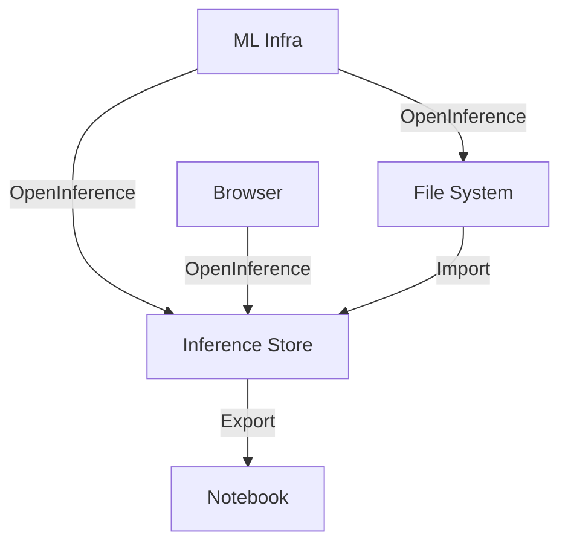

# OpenInference

This is a a working draft of the specification for OpenInference - a specification that encompass two data models:

-   [Inferences](./inference/README.md)
-   [Traces](./trace/README.md)

Inferences are designed to capture inference logs from a variety of model types and use-cases where as traces are designed to capture the execution of an application that results in invocations of an LLM.

OpenInference data is designed to be stored in a data lake or data warehouse and provides a standardized format that simplifies the analysis of inference data.

